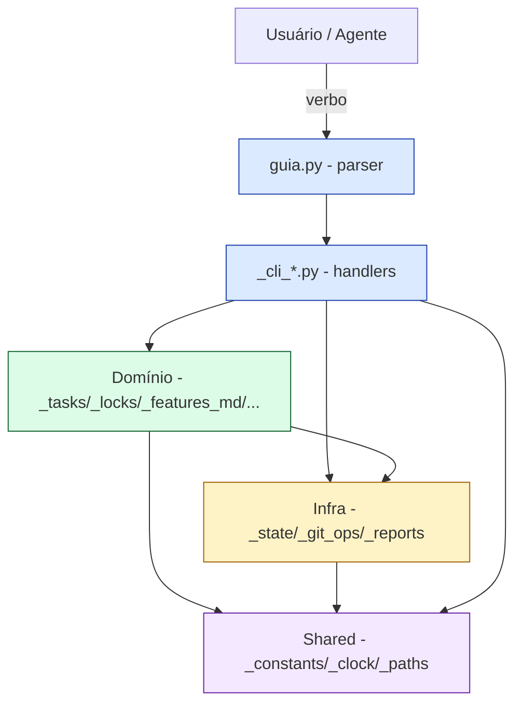

# ADR-0017: Manter `core/src/` flat e RECUSAR a reorganização em camadas (D-053)

## Status

aceito

## Contexto e problema

O backlog `D-053` propunha reorganizar os 19 arquivos atualmente flat em `core/src/` em quatro subpastas seguindo Clean Architecture nominal: `cli/`, `domain/`, `infra/`, `shared/`. A motivação era nominal — "adotar Clean Architecture" — e não respondeu a uma dor medida.

O guia-fluxo é uma CLI Python single-user (Claude Code / Codex / Antigravity plugin) que persiste estado em JSON sob `.guia/`, sem banco, sem rede, sem concorrência real e **sem intenção declarada de trocar infraestrutura** (git, FS local, JSON). O domínio tem cerca de 7 conceitos (task, demanda, lock, hook, commit, worktree, validação), regras estáveis e CRUD-like. A nomenclatura por prefixo (`_cli_*`, `_locks`, `_features_md`, `_constants`) **já agrupa os arquivos por camada lógica implícita** — a separação que a proposta D-053 quer materializar em pastas **já é reconhecível pelo nome do arquivo**, sem nenhum custo.

O custo real da reorganização completa é alto: atualizar ~50+ imports, ajustar o build (`render-skills.py` espelha flat em `plugins/guia/bin/`), decidir se o consumidor recebe layout flat ou hierárquico (impacto de plugin-cache), adicionar `__init__.py` (que o projeto deliberadamente evita), e quebrar testes que importam direto. Risco de regressão **alto** (lock + hook + render são caminhos críticos).

Pergunta de decisão: **o domínio justifica subir do Degrau 1 (monólito leve + convenção de prefixo) para o Degrau 2 (Clean/Hexagonal), ou Clean aqui é over-engineering?**

## Suposições

- Single-user CLI; sem multi-team, sem multi-tenant. ✅ confirmado.
- Sem intenção de trocar infraestrutura (git, FS, JSON). ✅ confirmado pelo dono.
- Crescimento orgânico de verbos (recém: D-067 `_cli_deps`; D-091 `cmd_upgrade`) mas o domínio em si permanece estável (status, kind, lock, demanda). ✅
- Time de 1 dev + agentes; nenhum reforço previsto. ⚠️ (assumido)
- Não há demanda funcional pendente que dependa de inversão de infra. ✅

## Critérios de decisão

Derivados dos drivers reais:

- **Clareza de navegação** — quem chega entende rapidamente?
- **Custo de migração** — quanto código quebra?
- **Custo recorrente** — quão fácil é adicionar um verbo novo?
- **Risco de regressão** — quebrar lock, hook ou render é caro.
- **Capacidade de evolução** — dá pra subir um degrau depois, sem dor?

## Opções consideradas

1. **Manter flat + formalizar convenção de prefixo** (status quo melhorado).
2. **Reorg parcial — extrair só `shared/`** (ou `_utils/`) com os 4 utilitários (`_constants`, `_clock`, `_paths`, `_process_config`).
3. **Reorg completa em 4 camadas** (`cli/`, `domain/`, `infra/`, `shared/`) — proposta original do D-053.
4. **Slice por feature** (`creation/`, `lifecycle/`, `deps/`) — vertical em vez de horizontal.

## Matriz de decisão

| Critério (peso) | A. Flat | B. Parcial | C. Completa | D. Slice |
|---|---|---|---|---|
| Clareza (×4)            | 4 | 4 | 4 | 3 |
| Custo migração (×4)     | 5 | 4 | 1 | 2 |
| Custo recorrente (×3)   | 4 | 4 | 3 | 3 |
| Risco regressão (×5)    | 5 | 4 | 2 | 2 |
| Evolução futura (×2)    | 4 | 5 | 4 | 3 |
| **Score ponderado**     | **78** | **76** | **53** | **52** |

## Decisão

**Escolhida: Opção A — manter `core/src/` flat, formalizar a convenção de prefixo neste ADR (tabela abaixo), e RECUSAR a D-053.**

**Right-sizing:** o projeto está no Degrau 1 da escada — monólito leve em camadas implícitas via convenção de nome. Subir para o Degrau 2 (Clean/Hexagonal) seria **over-engineering** sem dor medida: não há trocas de infra previstas, o domínio é simples e estável, e o time é uma pessoa. Ficar em Degrau 0 puro (sem qualquer convenção) seria **under-engineering** — o projeto já passou disso quando adotou os prefixos. O equilíbrio certo é o estado atual.

**Design de código recomendado:** monólito em arquivo único Python flat com convenção de prefixo estabelecida:

| Prefixo / arquivo | Camada lógica | Responsabilidade |
|---|---|---|
| `guia.py` | CLI entry | Parser argparse + dispatch |
| `_cli_*.py` | CLI handlers | Tradução de args → chamada de domínio |
| `_tasks.py`, `_features_md.py`, `_docs_hook.py`, `_locks.py`, `_commit.py`, `_worktree.py`, `_validation_runner.py` | Domínio | Regras + persistência via wrappers |
| `_git_ops.py`, `_state.py`, `_reports.py` | Infra | I/O externa (git, FS JSON, relatórios) |
| `_constants.py`, `_clock.py`, `_paths.py`, `_process_config.py` | Shared | Constantes, fundamentos, sem regra |

Regras de coesão:

1. **CLI nunca lê/escreve JSON nem chama git diretamente** — passa pelo domínio ou pela infra.
2. **Domínio pode chamar infra**; **infra não chama domínio**.
3. **Shared não importa nada de domínio / infra / CLI** (folha).
4. Novo verbo → novo `_cli_<verbo>.py`; nova regra de domínio → novo `_<conceito>.py`.
5. Quando um arquivo passa de ~300 linhas ou começa a misturar duas camadas, considere quebrar — mas **flat continua**.

Estrutura de pastas:

```
core/
├── src/                        # FLAT — sem subpastas, por decisão
│   ├── guia.py                 # entry point
│   ├── _cli_*.py               # handlers da CLI
│   ├── _<conceito>.py          # domínio
│   ├── _state.py, _git_ops.py  # infra
│   └── _constants.py, _clock.py, _paths.py, _process_config.py  # shared
├── lock/                       # já isolado (ADR anterior)
├── manifest/                   # bodies + manifest.yaml
├── build/                      # render-skills.py
├── hooks/                      # commit-msg fonte
└── templates/                  # templates por-projeto
```

## Postura por tecnologia (para ESTE projeto)

| Tecnologia | Postura | Observação |
|---|---|---|
| Python stdlib + PyYAML | **Adopt** | Zero deps é uma restrição que protege o projeto. |
| Convenção de prefixo `_cli_/_*` | **Adopt** | Estrutura sem custo, formalizada aqui. |
| Subpastas por camada (Clean/Hexagonal) | **Hold** | Não traz retorno na escala atual. Reabrir só com gatilho objetivo. |
| `__init__.py` em `core/src/` | **Hold** | Mudaria como o plugin-cache resolve módulos. |
| Slice por feature (`creation/`, `lifecycle/`) | **Assess** | Pode ganhar tração quando houver muitos verbos; reavaliar junto. |

## Diagrama



> As "camadas" existem **logicamente** (cores no diagrama), mas **fisicamente os arquivos vivem flat** em `core/src/`. Esta é a decisão.

## Consequências

- **Bom — clareza sem custo:** quem chega no código identifica a camada de cada arquivo só pelo prefixo; nenhum import precisa mudar; `render-skills.py` segue como está; `plugins/guia/bin/` segue flat (consumidor não sente nada).
- **Bom — recusa sem perder rastreio:** o ADR documenta a decisão e o gatilho pra reabrir; futuro mantenedor não re-litiga isso por estética.
- **Ruim — disciplina depende do dono:** sem subpastas, nada impede um `_cli_*` importar `_state` direto e pular o domínio (Regra 1). Mitigação: code review + esta seção como referência canônica.
- **Ruim — refactor adiado fica mais caro depois:** se o projeto crescer muito além do previsto, migrar 30+ arquivos é pior do que migrar 19. Mitigação: o gatilho de revisão abaixo é o circuit-breaker.
- **Neutro — alinhamento com YAGNI:** decisão padrão para CLIs Python pequenas.

## Prós e contras das opções

### Opção A — Flat + convenção (escolhida)

- Bom, porque custo de migração zero e risco de regressão zero.
- Bom, porque a estrutura já é reconhecível pelo nome do arquivo.
- Bom, porque a convenção pode ser formalizada num ADR (este) sem mexer no código.
- Neutro, porque depende de disciplina; sem subpasta, nada impede a violação silenciosa das regras de coesão.
- Ruim, porque o argumento "ainda dá pra navegar" tem prazo de validade: se o projeto crescer 3x sem revisão, vira problema.

### Opção B — Reorg parcial (só `shared/`)

- Bom, porque separa fundamentos (constantes, paths, clock) do resto — o ganho mais alto de clareza por menor custo.
- Bom, porque é evolução incremental: vira o caminho natural se o projeto crescer.
- Ruim, porque ainda exige `__init__.py` e ajustes em `render-skills.py` e testes; risco médio.
- Ruim, porque não resolve dor real hoje — só "fica mais organizado".

### Opção C — Reorg completa em 4 camadas (proposta original D-053)

- Bom, porque vira documentação executável da arquitetura (camadas viram pastas).
- Bom, porque facilita testar domínio puro mockando infra (se isso virar necessidade).
- Ruim, porque é Degrau 2 sem justificar (sem trocas de infra, sem domínio rico) — over-engineering pelo critério da escada.
- Ruim, porque o churn é alto: ~50 imports, build, testes, plugin-cache.
- Ruim, porque adiciona `__init__.py` que o projeto evita por design.

### Opção D — Slice por feature

- Bom, porque alinha com o jeito do guia-fluxo crescer (por verbo).
- Ruim, porque os `_cli_*` já fazem isso pela convenção de nome.
- Ruim, porque cruza pessimamente com a camada — `_cli_creation` toca vários conceitos do domínio.

## Substitui / relaciona

- **NÃO substitui o ADR-0007** ("Arquitetura modular core/src com Clean Architecture"). O ADR-0007 decidiu **quebrar o monolito original em vários arquivos** — decisão correta e mantida. Este ADR-0017 só **recusa o próximo passo proposto pelo D-053** (mover arquivos para subpastas) e formaliza a convenção de prefixo como o degrau certo agora.
- **Espelha o ADR-0016** (camada de serviços recusada) na forma "ADR de recusa": documenta o porquê de não fazer, com gatilho de revisão.

## Disposição do backlog

- **D-053 → Resolvida (recusada).** A motivação era nominal; este ADR registra a decisão e o gatilho. Reabrir só com gatilho objetivo cumprido.

## Gatilho de revisão

Reabrir esta decisão se **qualquer um** dos sinais surgir:

- `core/src/` passa de **~30 arquivos** (hoje: 19).
- Surge **necessidade concreta** de testar domínio sem mockar git/FS (i.e. uma feature pede inversão de dependência real).
- **2+ devs novos** chegam e relatam dificuldade em navegar pelo prefixo.
- Aparece uma proposta de **trocar a infra** (ex: trocar git por outra coisa, ou JSON por banco) — Hexagonal passa a se pagar.
- Um arquivo `_cli_*` passa de **~500 linhas** ou começa a misturar 3+ conceitos do domínio.

Quando reabrir: **provavelmente Opção B (reorg parcial extraindo `shared/`)** como degrau intermediário antes de considerar Opção C.
